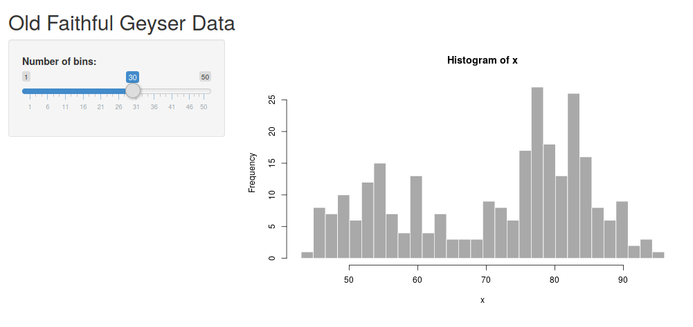
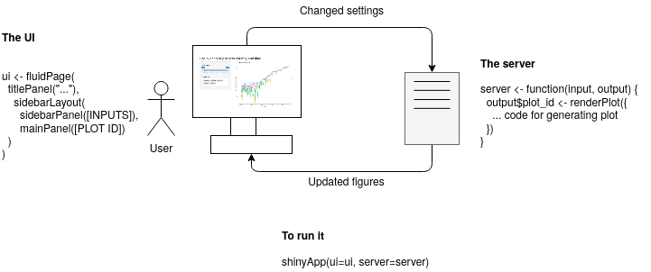
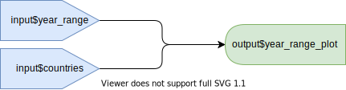
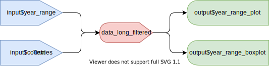

# Introduction

The {shiny} R package allows users to rapidly set up interactive interfaces to their datasets. It is powerful in that it provides a lot of functionality with very little code. As you will see in this tutorial, you can build a fully functional and highly useful interface to your data in around fifty lines of code. This interface can then be rapidly deployed and shared.

The tutorial is designed to expect no prior knowledge with {shiny}, and limited knowledge in R. If you have some prior experience you can breeze through the initial sections and find intermediate exercises and topics towards the end.

A convenient cheat sheet covering various commonly used {shiny} functionality can be found here: https://shiny.rstudio.com/images/shiny-cheatsheet.pdf

# Preparations

## Installing and loading required R packages

This tutorial assumes that you have the following things prepared:

* R Studio
* The R packages: {shiny}, {tidyverse}

You can install the packages by running the chunk below. Note that this might take some time - in particular if the {tidyverse} package is not installed.

```{r eval=FALSE}
install.packages(c("shiny", "tidyverse"))
```

Once installed, load the packages.

```{r}
library(shiny)
library(tidyverse)
theme_set(theme_classic())  # Replaces the default ggplot2 look, not required
```

## Preparing a dataset

### Retrieving the data

This tutorial uses a dataset from [Gapminder](https://www.gapminder.org/data) - an organization promoting a factful view of the world. The dataset contains life expectancies in different countries since 1800. Gapminder have many useful datasets exploring different aspects of the world. Feel free to take a look and use whichever tickles your interest.

Other great pages for datasets:

* [Kaggle](https://www.kaggle.com/), has many great datasets, but might require some more pre-parsing before visualizing
* If you want to visualize something related to Coronavirus, here is a [source data home page](https://ourworldindata.org/coronavirus-source-data)

## (Optional) Parsing the data from scratch

**Note: If you don't want to do this part - jump straight to the next section and load the data preparsed.**

I have prepared a comma-separated Gapminder dataset on life expectancy from year 1800. If you have your own dataset, exchange the file path for that one instead and adjust the code accordingly. Use the `head` command to inspect the first few rows.

```{r}
data_wide <- read_csv("data/gapminder_life_expectancy_years.csv")
head(data_wide)
```

This data is in *wide format*, meaning that we have one column per year. In the plotting library {ggplot2} (part of {tidyverse}) the data is expected to be in *long* format with one column showing the year and one column containing all the life expectancies.

For instance, the following matrix is in wide format - the measured data is spread over multiple columns.

```
country   1900   1950   2000
Sweden    60     77     80
Denmark   65     79     82
```

The same data is illustrated in long format below. Now we have one column containing all measurements and one extra columns specifying from which year the measurement was taken. This is harder to read, but easier for a computer program to manage.

```
country  year  life_expectancy
Sweden   1900  60
Sweden   1950  77
Sweden   2000  80
Denmark  1900  65
Denmark  1950  79
Denmark  2000  82
```

The transformation from wide to long format can be done using the command `pivot_longer` (part of the {tidyr} package, which is part of the {tidyverse}). Make sure to inspect
 the data with `head` to see what you are working with.

```{r}
data_long <- data_wide %>% 
# The -1 means that we pivot all columns except the first to one column
    pivot_longer(-1, names_to = "year", values_to="life_expectancy") %>%
    mutate(year=as.numeric(year))

# Slicing out the first column headers
head(data_long)
```

## Loading the data preparsed

If you didn't want to do the previous section you can load the data directly. This will load a three-column dataset specifying country, measurement year and estimated life expectancy for that country and year.

```{r}
data_long <- read_csv("data/gapminder_life_expectancy_years_parsed.csv")
head(data_long)
```

# A quick peek at a Shiny interface

Before building from scratch, let's take create the default Shiny-app to see how a simple interface could look - and to verify that you have {shiny} properly installed.

In RStudio, go to `File -> New File -> Shiny Web App`, write in a name for the application and leave the application type as the default (single file). Click "Create".

This will generate a skeleton for an app. Try runnning it by clicking "Run app". This should open the default shiny application (looking like the image below). Try dragging the "number of bins" slider. The plot should change accordingly.




There are two parts of this application - the "UI" and the "server" part. The UI is that the user interacts with, and the server calculates things in the background. 

In this case, the UI consists of the slider where you can determine the number of bins, and an output point specifying where the figure should go. This is what is happening on the user's side.

The server contains the code calculating the figure and delivers it to the UI. This is happening in the background, often on a computer somewhere in the 'cloud'.

Here is an attempt to illustrate this.



The {shiny} app does in principle consist of the UI part and the server part.

## The UI

The **UI** ("User Interface") is used to specify what "elements" should be included in the R Shiny graphical interface. This produces HTML which is used to display your element in the browser. You can try printing the ui object (`print(ui)`) and you will see that it is simply HTML. 

There are different types of page layouts - `fluidPage()` is a layout based on the Bootstrap web library (LINK) and allows designing your web page in rows, within which you can specify columns.

## The server

The **server** part is what will happen in the background. If deploying as a web page, this part will be run on the computer hosting the code, while the UI will be run on the users computer. This part will generate data and figures which subsequently can be displayed in the interface.

The `function(input, output) {}` is the server function. It always takes the UI input and output elements as arguments. The `input` will contain all your input elements, such as the slider. The `output` will contain the output points, such as where the plots should be rendered. Right now the body of it is empty. Soon we will add more code here!

## A note on reactivity

In the default example we saw an interactive histogram. The UI contains information about that we want a panel layout, one input element and one output point for the plot. The server will recalculate the the plot based on the input it receives (in this case - from a single input slider) and send it to the UI to be displayed.

You can see it in its very minimal form in the geyser dataset. There is one input with the ID "bins". This input is used to calculate the plot which subsequently is sent to the output "distPlot".


This is a lazy kind of evaluation - the server code will only run when it needs to. The term for this kind of programming is 'reactive programming'. More on this later.

## Exercises

1. Take a look at the code for the geyser dataset. Identify the "bins" and the "distPlot" ID in the UI part. Next, look into the server part. How are they used in this part?
2. Make some adjustment to the UI. Try changing the header and the "Number of bins" label.
3. Try adding a descriptive text above the plot using the `p("text")` element.
4. See if you can add a custom header to the histogram, allowing a user to change the header interactively. Use the `?hist` to see how to change its header. You can add a text input to the interface using the code `textInput(<id>, <label>)`, exchanging `<id>` and `<label>` with your own values.

# Shiny from scratch

## A minimal application

We will step by step build a complete R Shiny application for the dataset we previously prepared. If successful, you will have enough knowledge at the end to start building your own Shiny applications.

You can run the code directly from this notebook by executing the chunks one by one, or create an empty .R file (for instance named `app.R`) where you step by step build the application. At this point you will only get a blank page.

```{r}
# library(shiny) <- Uncomment if running in a separate .R file, already loaded in the notebook
ui <- fluidPage()
server <- function(input, output) {}  
shinyApp(ui=ui, server=server)
```

## Preparing the UI

Here we will add some different headers and input elements, as well as an output point where we later will show two figures.

### Adding a minimal layout

Now we will add a title using the `titlePanel` function and a sidebar layout using the `sidebarLayout` function.

You can use many different types of layout for RShiny. Here, we stick with the default "sidebarLayout" which gives us a panel to the left for the settings, and a bigger panel to the right for showing plots. We insert both the `titlePanel` and the `sidebarLayout` within the `fluidPage` function we specified previously. 

Note that the elements are separated by commas, and nested (similar to HTML). A common error is to miss one comma, or use one too many. Often RStudio will give you useful hints on where to look to fix this.

Try running the code now. Doesn't look so fancy yet, but now the foundation is there.

```{r}
# library(shiny) <- Uncomment if running in a separate .R file
ui <- fluidPage(
    titlePanel("Life expectancy across country and time"),
    sidebarLayout(
        sidebarPanel(),
        mainPanel()
    )
)
server <- function(input, output) {}
shinyApp(ui=ui, server=server)
```

You can directly inspect the HTML building the UI by printing the `ui` variable. The important point to note here is that at this point we are simply creating HTML, just in a more convenient way. (If you are familiar with the Javascript Bootstrap library you probably recognize how {shiny} is using Bootstrap to specify rows and columns).

```{r}
print(ui)
```

### UI inputs and outputs

Some very useful examples:

* **sliderInput** Interactive slider
* **checkboxInput** A simple checkbox
* **numericInput** Directly specify a numeric value
* **textInput** Freely write text
* **selectInput** Select one or more of a set of predefined choices

Let's start with just a slider. You can check which arguments it requires by running `?sliderInput` (this is a useful way to check documentation for any function). All input elements require an ID (which we need to identify it in the server code later) and a label which will show the user what it does. 

Beyond that, the required values differs with the element. You can always check the documentation using the `?` syntax. For instance, the `sliderInput` needs a minimum and maximum value and a default value. Also, it is often useful to specify `step` argument, specifying its stepsize.

Next, we need to specify an output point. Here, we can render different things such as figures, images, text or tables. We start with an output for rendering a figure using the `plotOutput`. This only requires `outputID` as argument, the the unique ID for this output point.

Try running it now. Now you should be able to see the layout and interact with the UI. Still not so interesting though - because there is nothing going on in the server.

```{r}
# library(shiny) <- Uncomment if running in a separate .R file
ui <- fluidPage(
    titlePanel("Life expectancy across country and time"),
    sidebarLayout(
        sidebarPanel(
            sliderInput(inputId="year_range", label="Year range", min=1800, max=2030, step=1, value = c(1800, 2030)),
            selectInput(inputId="countries", label="Countries", choices = c("Sweden", "Denmark", "Norway", "Iceland", "Finland"), selected="Sweden")
        ),
        mainPanel(
            plotOutput(outputId="year_range_plot")
        )
    )
)
server <- function(input, output) {}
shinyApp(ui=ui, server=server)
```

## Setting up the server

Up until now our server function have been completely empty. Now we will add code for generating a figure which subsequently will be sent to the UI and shown to the user.

### Creating the plot

It is generally a good practice to make sure you understand the pieces you are working with before building them together. In RShiny I prefer to always make sure the data parsing and plotting works independently before plugging them into RShiny.

We loaded our dataset in the beginning of this tutorial. It is in three columns which specify country, year and the life expectancy.

We can filter out certain entries from the data frame using the `filter` command. Let's prepare a dataset only containing life expectancy values for Sweden.

```{r}
data_long_sweden <- data_long %>% filter(country == "Sweden")
head(data_long_sweden)
```

Next, we insert it into ggplot. There are three key point here:

* The input data should be in long format - one column per type of data
* We specify one or several aesthetics (such as position or coloring)
* We specify one or several geometics

```{r}
ggplot(data_long_sweden, aes(x=year, y=life_expectancy)) + 
    geom_line() +
    ggtitle("Swedish life expectancy")
```

Looking good! 

Now, let's see if we can focus on a smaller range by filtering the dataset further before plotting it.

```{r}
data_long_sweden_range <- data_long %>% 
    filter(country == "Sweden") %>%
    filter(year >= 1900 & year <= 2000)
head(data_long_sweden_range)
ggplot(data_long_sweden_range, aes(x=year, y=life_expectancy)) + 
    geom_line() +
    ggtitle("Swedish life expectancy")
```

We can clearly see the effect of the Spanish flu which hit Sweden 1918 and infected a third of Swedens population. Other than that it looks like the 20ths went pretty well for us.

Now we have everything we need to make this interactive! `ggplot2` is a whole workshop in itself. If this is new - no worries. You can start with these pieces of working code, and gradually figure out what you can change. Here is a cheat sheet if you want some further inspiration: https://github.com/rstudio/cheatsheets/blob/master/data-visualization-2.1.pdf

### Inserting the plot in RShiny

Now, we are ready to run the plot within R Shiny. We use the same UI as before, but now we add a server part which send a static ggplot figure to the "distPlot" output point. (Remember that you specified this as a plotOutput point in the main panel).

Try it out! At this point you should see the same plot as we previously produced using ggplot, but nothing will happen when you drag the sliders.

```{r}
# library(shiny) <- Uncomment if running in a separate .R file
# library(tidyverse)
# data_long <- read_csv("data/gapminder_life_expectancy_years_parsed.csv")

ui <- fluidPage(
    titlePanel("Life expectancy across country and time"),
    sidebarLayout(
        sidebarPanel(
            sliderInput(inputId="year_range", label="Year range", value=c(1800, 2030), min=1800, max=2030, step=1),
            selectInput(inputId="countries", label="Countries", choices = c("Sweden", "Denmark", "Norway", "Iceland", "Finland"), selected="Sweden")
        ),
        mainPanel(
            plotOutput(outputId="year_range_plot")
        )
    )
)
server <- function(input, output) {
    
    output$year_range_plot <- renderPlot({
        
        data_long_sweden_range <- data_long %>% 
            filter(country == "Sweden") %>%
            filter(year >= 1900 & year <= 2020)
        
        ggplot(data_long_sweden_range, aes(x=year, y=life_expectancy)) + 
            geom_line() +
            ggtitle("Swedish life expectancy")
    })
    
}
shinyApp(ui=ui, server=server)
```

### Making our Shiny app interactive

We access the output point of the UI using `output$distPlot`. Similarly, we can access our input elements using `input$bins` and `input$title`. We specify these ones directly within the `renderPlot`. 

By doing this, we link these parameters from the interface into the plot. RShiny will now automatically detect when any of these change, and when this happends, it will rerun the code. 

This time our reactive diagram looks only slightly more complicated. We have one output point, but it depends on two different inputs. If either of these change, so will the plot.



Try it out! Change the number of bins and title. You should directly see these changes appear in the plot.

```{r}
# library(shiny) <- Uncomment if running in a separate .R file
# library(tidyverse)
# data_long <- read_csv("data/gapminder_life_expectancy_years_parsed.csv")

all_countries <- unique(data_long$country)

ui <- fluidPage(
    titlePanel("Life expectancy across country and time"),
    sidebarLayout(
        sidebarPanel(
            sliderInput(inputId="year_range", label="Year range", value=c(1800, 2030), min=1800, max=2030, step=10),
            selectInput(inputId="countries", label="Countries", choices = all_countries, multiple = TRUE, selected=c("Sweden", "Denmark", "Norway", "Iceland", "Finland"))
        ),
        mainPanel(
            plotOutput(outputId="year_range_plot")
        )
    )
)
server <- function(input, output) {
    
    output$year_range_plot <- renderPlot({
        
        data_long_filtered <- data_long %>% 
            filter(country %in% input$countries) %>%
            filter(year >= input$year_range[1] & year <= input$year_range[2])
        
        ggplot(data_long_filtered, aes(x=year, y=life_expectancy, color=country)) + 
            geom_line() +
            ggtitle("Life expectancies") +
            xlab("Year") +
            ylab("Life expectancy (years)")
    })
}
shinyApp(ui=ui, server=server)
```

If everything works fine then you should be able to explore the data now! Try changing the selected year range to focus on different centuries.

### Exercises

* Which nordic country had the lowest overall life expectancy during 1900-1950?
* 1800 to 1900 was a rocky ride (or have more erratic data, not sure which). Which nordic country was overall best off back then?
* Select a few countries - roughly one from each continent and look at the trends. Are they roughly as you expected?
* Try adding an option for line width. The `geom_line` argument can take a size argument (`geom_line(size=3)` for example). See if you can add a slider where the user can decide the width.
* Add an input text argument where the title of the plot can be specified
* You can display individual data points by replacing the `geom_line` with the `geom_point` argument. Add a checkbox input where the user can decide how the data should be displayed.
* Add another numeric argument which can specify the size of the font (this can be done by adding a `+ theme(text=element_text(size=20))` argument after the existing ggplot arguments)

## Simultaneously showing the data from multiple angles

One of the powerful things with RShiny is how easy it is to extend the interface to accomodate multiple figures showing different aspects of the same data.

Here, we produce a boxplot for the same dataset.

First, let's try out the plot separately. We use code very similar to previously, but we exchange the `geom_line` with a `geom_boxplot`.

```{r}
data_long_countries_range <- data_long %>% 
    filter(country %in% c("Sweden", "Denmark", "Norway", "Finland", "Iceland")) %>%
    filter(year >= 1920 & year <= 2020)
head(data_long_countries_range)
ggplot(data_long_countries_range, aes(x=year, y=life_expectancy, color=country)) + 
    geom_boxplot() +
    ggtitle("Nordic countries life expectancy 1900 - 2020")
```

It seems like the better years are relatively similar, but there have been some tougher years in Finland and Iceland during the last 100 years.

Now we are ready to link this into the server part.

```{r}
# library(shiny) <- Uncomment if running in a separate .R file
# library(tidyverse)
# data_long <- read_csv("data/gapminder_life_expectancy_years_parsed.csv")

all_countries <- unique(data_long$country)

ui <- fluidPage(
    titlePanel("Life expectancy across country and time"),
    sidebarLayout(
        sidebarPanel(
            sliderInput(inputId="year_range", label="Year range", value=c(1800, 2030), min=1800, max=2030, step=10),
            selectInput(inputId="countries", label="Countries", choices = all_countries, multiple = TRUE, selected=c("Sweden", "Denmark", "Norway", "Iceland", "Finland"))
        ),
        mainPanel(
            plotOutput(outputId="year_range_plot"),
            plotOutput(outputId="year_range_boxplot")
        )
    )
)
server <- function(input, output) {
    
    output$year_range_plot <- renderPlot({
        
        data_long_filtered <- data_long %>% 
            filter(country %in% input$countries) %>%
            filter(year >= input$year_range[1] & year <= input$year_range[2])
        
        ggplot(data_long_filtered, aes(x=year, y=life_expectancy, color=country)) + 
            geom_line() +
            ggtitle("Life expectancies") +
            xlab("Year") +
            ylab("Life expectancy (years)")
    })
    
    output$year_range_boxplot <- renderPlot({
        data_long_filtered <- data_long %>% 
            filter(country %in% input$countries) %>%
            filter(year >= input$year_range[1] & year <= input$year_range[2])
        
        ggplot(data_long_filtered, aes(x=year, y=life_expectancy, color=country)) + 
            geom_boxplot() +
            ggtitle("Life expectancies, boxplot")
    })
    
}
shinyApp(ui=ui, server=server)
```

Great! One ugly part here though is that we needed to duplicate the parsing part  of the dataset (converting `data_long` into `data_long_filtered`). This is something we want to avoid as this kind of coding over time will make our code less maintainable and less readable. The way to do this in R Shiny is by using a reactive variable (here named `data_long_filtered`).



We use the `reactive` keyword and put in an expression which here is dependent on the reactive input variables `input$countries` and `input$year_range`. This expression will be rerun every time any of these input variables change, which in turn will trigger the plots to rerender (which now both depend on this reactive element).

```{r}
# library(shiny) <- Uncomment if running in a separate .R file
# library(tidyverse)
# data_long <- read_csv("data/gapminder_life_expectancy_years_parsed.csv")

all_countries <- unique(data_long$country)

ui <- fluidPage(
    titlePanel("Life expectancy across country and time"),
    sidebarLayout(
        sidebarPanel(
            sliderInput(inputId="year_range", label="Year range", value=c(1800, 2030), min=1800, max=2030, step=10),
            selectInput(inputId="countries", label="Countries", choices = all_countries, multiple = TRUE, selected=c("Sweden", "Denmark", "Norway", "Iceland", "Finland"))
        ),
        mainPanel(
            plotOutput(outputId="year_range_plot"),
            plotOutput(outputId="year_range_boxplot")
        )
    )
)
server <- function(input, output) {
    
    data_long_filtered <- reactive({
        data_long %>% 
            filter(country %in% input$countries) %>%
            filter(year >= input$year_range[1] & year <= input$year_range[2])
    })
    
    output$year_range_plot <- renderPlot({
        
        ggplot(data_long_filtered(), aes(x=year, y=life_expectancy, color=country)) +
            geom_line() +
            ggtitle("Life expectancies") +
            xlab("Year") +
            ylab("Life expectancy (years)")
    })
    
    output$year_range_boxplot <- renderPlot({
        ggplot(data_long_filtered(), aes(x=year, y=life_expectancy, color=country)) + 
            geom_boxplot() +
            ggtitle("Life expectancies, boxplot")
    })
    
}
shinyApp(ui=ui, server=server)
```

Exercises

* Let the user customize the plot titles separately by adding two `textInput` UI fields. Make sure to have useful default values.
* Add a third output point and display the data using some other ggplot geom. You could for instance display it using `geom_density` or `geom_point`.
* (Advanced) If you are familiar with statistics - calculate the ANOVA across the different countries for the selected datasets and indicate the resulting p-value in the plot title.

# Extended reading

These sections are intended to showcase some features I have found to be very useful in regards to RShiny, but are not strictly needed to get started. Feel free to read it, run it, skim it or skip it.

To complete this part you need three additional packages: {DT} for interactive tables, {plotly} for interactive plots (interactive such that you can use your mouse and interact directly with the plot) and {rsconnect} for rapidly deploying your {shiny} applications online.

```{r eval=FALSE}
install.packages(c("DT", "plotly", "rsconnect"))
```

When they are installed - load them.

```{r}
library(DT)
library(plotly)
library(rsconnect)
```

## Showing interactive tables using DT

We might want to show the displayed raw data directly. There is a built in way of displaying tables, but using {DT} it looks much more attractive. The output point is called `DTOutput`, and for rendering we use the command `DT::renderDataTable`.

The reactive table obtained from `data_long_filtered` can be rendered directly, but it is often easier for humans to read in wide format. For this, we can use the {tidyr} (part of Tidyverse) command `pivot_wider` where we specify which column contains what will become colum headers, and what column contains the values.

```{r}
# library(shiny) <- Uncomment if running in a separate .R file
# library(tidyverse)
# library(plotly)
# library(DT)
# data_long <- read_csv("data/gapminder_life_expectancy_years_parsed.csv")

all_countries <- unique(data_long$country)

ui <- fluidPage(
    titlePanel("Life expectancy across country and time"),
    sidebarLayout(
        sidebarPanel(
            sliderInput(inputId="year_range", label="Year range", value=c(1800, 2030), min=1800, max=2030, step=10),
            selectInput(inputId="countries", label="Countries", choices = all_countries, multiple = TRUE, selected=c("Sweden", "Denmark", "Norway", "Iceland", "Finland"))
        ),
        mainPanel(
            plotOutput(outputId="year_range_plot"),
            plotOutput(outputId="year_range_boxplot"),
            DT::dataTableOutput(outputId="table_display")
        )
    )
)
server <- function(input, output) {
    
    data_long_filtered <- reactive({
        data_long %>% 
            filter(country %in% input$countries) %>%
            filter(year >= input$year_range[1] & year <= input$year_range[2])
    })
    
    output$year_range_plot <- renderPlot({
        
        ggplot(data_long_filtered(), aes(x=year, y=life_expectancy, color=country)) +
            geom_line()
    })
    
    output$year_range_boxplot <- renderPlot({
        ggplot(data_long_filtered(), aes(x=country, y=life_expectancy, fill=country, text=year)) + 
            geom_boxplot()
    })
        
    output$table_display <- DT::renderDataTable({
        data_long_filtered() %>% pivot_wider(names_from="year", values_from="life_expectancy")
    })
}
shinyApp(ui=ui, server=server)
```


## Further interactivity with Plotly

Plotly is a library giving us the chance to make the plots directly interactive - meaning that we can hover and click elements directly, and use a range of tools such as zooming. It is possible to use it to do more advanced tasks such as executing code when clicking or marking certain parts of the graph, but that is beyond the scope of this tutorial.

To use Plotly you need to load (and install) the library {plotly}. It has its own custom syntax for defining plots and contains a range of plots (it can also be used in Python). It is also compatible with ggplot-plots using the `ggplotly` function.

To incorporate Plotly, we need to update our `plotOutput` and `renderPlot` points to `plotlyOutput` and `renderPlotly`. Next, we convert our ggplot outputs by sending the plot object into the `ggplotly` function. Then we are ready to go!

Some things do not work out of the box here unfortunately. For instance, I would have preferred to show the year in addition to the life expectancy. To achieve this you might need to look into the Plotly documentation (https://plotly.com/r/box-plots/).

```{r}
# library(shiny) <- Uncomment if running in a separate .R file
# library(tidyverse)
# library(plotly)
# If running in a separate .R file - insert the loading of the dataset here

all_countries <- unique(data_long$country)

ui <- fluidPage(
    titlePanel("Life expectancy across country and time"),
    sidebarLayout(
        sidebarPanel(
            sliderInput(inputId="year_range", label="Year range", value=c(1800, 2030), min=1800, max=2030, step=10),
            selectInput(inputId="countries", label="Countries", choices = all_countries, multiple = TRUE, selected=c("Sweden", "Denmark", "Norway", "Iceland", "Finland"))
        ),
        mainPanel(
            plotlyOutput(outputId="year_range_plot"),
            plotlyOutput(outputId="year_range_boxplot"),
            DTOutput(outputId="table_display")
        )
    )
)
server <- function(input, output) {
    
    data_long_filtered <- reactive({
        data_long %>% 
            filter(country %in% input$countries) %>%
            filter(year >= input$year_range[1] & year <= input$year_range[2])
    })
    
    output$year_range_plot <- renderPlotly({
        
        plt <- ggplot(data_long_filtered(), aes(x=year, y=life_expectancy, color=country)) +
            geom_line()
        ggplotly(plt)
    })
    
    output$year_range_boxplot <- renderPlotly({
        plt <- ggplot(data_long_filtered(), aes(x=country, y=life_expectancy, fill=country, text=year)) + 
            geom_boxplot()
        ggplotly(plt, tooltip="text")
    })
    
    output$table_display <- DT::renderDataTable({
        data_long_filtered() %>% pivot_wider(names_from="year", values_from="life_expectancy")
    })
}
shinyApp(ui=ui, server=server)
```

## Deploying the app to shinyapps.io

You already know how to run your app locally. If you have access to a server, you can deploy it yourself using Shiny server (https://rstudio.com/products/shiny/shiny-server/). This requires some Linux-knowledge, but is comparably much easier than deploying a server yourself from scratch!

An even easier way (if you are fine with deploying your app publicly) is to deploy it to `shinyapps.io`. This can be done in a matter of minute. You get up to 5 applications and 25 active hours for free. 

All instructions below are outlined in more details at https://docs.rstudio.com/shinyapps.io/getting-started.html.

First:

1. Go to shinyapps.io and create a new account - Note that your account name will be used as part of the URL for your apps
2. Install the R-package {rsconnect}

Next, you need to retrieve tokens used to connect. Go to the Account/Tokens page and click "Show". This will give you a line of code calling the function `rsconnect::setAccountInfo(name='accountname', token=<TOKEN>, secret=<SECRET>)`.

Now you are all set to deploy your app! Either by clicking the `publish` button in the top right (the blue symbol looking like an eye), or by executing the command:

```{r eval=FALSE}
rsconnect::deployApp()
```

Have some patience while it prepares it. At the end it will give you an URL. This is were you now can show of your Shiny app to anyone!

# Summary

That was it, hope it was useful!

If you have any trouble with this tutorial, feel free to throw me an email at jakob [dot] willforss [at] hotmail [dot] com. You can also find me on:

* GitHub
* Linkedin
* Twitter

# Session info

```{r}
sessionInfo()
```
